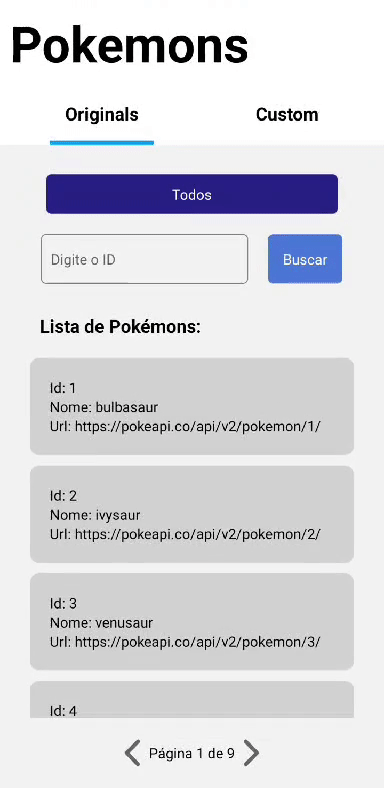
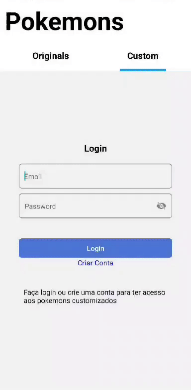
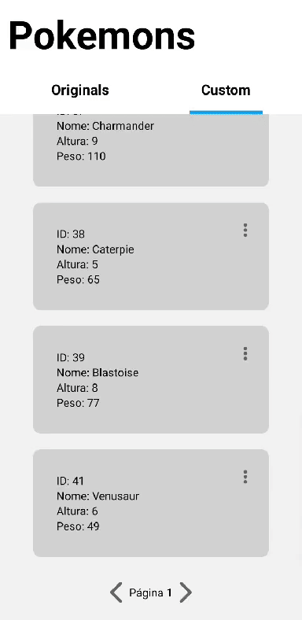
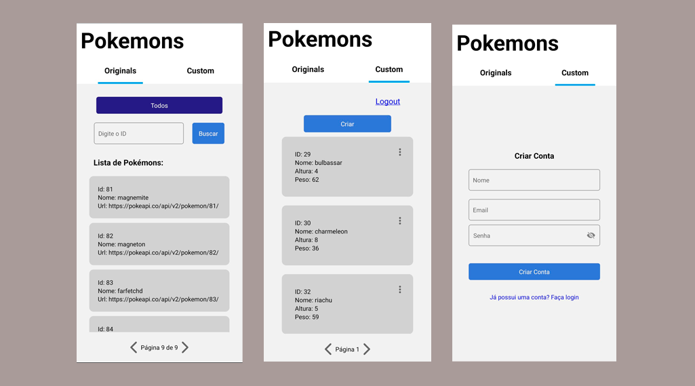

# pokemon

<p align="center">
  
  
  
</p>

Documentação da API [aqui](https://documenter.getpostman.com/view/27685475/2s9YR9aDTu)

## Sobre:
O objetivo do projeto é construir uma aplicação full stack contendo um backend com uma API Rest e um CRUD (com funcionalidades e acesso protegido pelo JWT) para criar, ler, editar e deletar pokemons e integrar com a API pública "https://pokeapi.co/", além de um frontend mobile-first que consome a API.

## Funcionalidades:
- [x]  <strong>Buscar dados da API pública:</strong> Criar endpoint GET que consuma a api de listagem de pokémons com paginação de 10 por página (limit e offset) e retorne os dados.
- [x]  <strong>Buscar dados da API pública pelo id:</strong> Criar endpoint GET que consuma a api com os dados de um pokémon pelo id e retorne os dados.
- [x]  <strong>Criar dados na API:</strong> Criar endpoint POST que permita a criação de um pokémon customizado com os atributos a seguir e salvar no banco de dados. atributos: id (number - auto increment), name, height, weight. Os dados de entrada são validados quanto a sua tipagem e se não forem nulos.
- [x]  <strong>Editar dados da API:</strong> Criar endpoint PUT que permita atualizar os atributos de um pokémon customizado no banco de dados pelo ID. Somente quem criou o Pokemon pode editá-lo.
- [x]  <strong>Excluir dados da API:</strong> Criar um endpoint DELETE que permita excluir um pokémon customizado do banco de dados pelo ID. Somente quem criou o Pokemon pode deletá-lo.
- [x]  <strong>Buscar dados da API:</strong> Criar um endpoint GET que retorna todos os pokémons customizados do banco de dados com paginação de 10 por página. 
- [x]  <strong>Criar documentação para API:</strong> Criar uma collection no Postman ou Insomnia com os endpoint para realizar os testes. [documentação](https://documenter.getpostman.com/view/27685475/2s9YR9aDTu)
- [x]  <strong>Frontend que consome API:</strong> Desenvolver um aplicativo React native que consuma essa API
- [x]   <strong>Login e Signup</strong> Criar um usuário ou Entrar em uma conta existente de usuário, validar email e senha e gerar token JWT de acesso para funcionalidades como visualizar, criar, editar e deletar pokemons.

## Como rodar a aplicação backend localmente:

```bash
# Clone o repositorio do projeto:
    git clone https://github.com/ojoaoneiva/pokemon.git

# Entre na pasta backend:
    cd pokemon
    cd backend

# Crie um arquivo .env nos moldes do .env.example com as varáveis de ambiente:

# Execute as migraçoes do banco de dados:
    npx typeorm migration:run
    
# Instale as dependencias da aplicação:
    npm i

# Inicie a aplicação:
    npm start

# O servidor irá iniciar no localhost:3000

```

## Como rodar a aplicação frontend localmente:

```bash
# Com o repositório já clonado e app backend funcionando:

# Entre na pasta frontend:
    cd ..
    cd frontend

# Instale as dependencias da aplicação:
    npm i

# Crie um arquivo config.js nos moldes do arquivo config.example.js para inserir variável de ambiente:

# Inicie a aplicação:
    npx expo start

# O servidor irá iniciar no Expo Development Server.
# Utilize o app Expo Go no celular android ou ios para ler o qrcode ou utilize um emulador para visualização no desketop
# Leia documentação da API para entender as requisições de cada endpoint.

```

## Tecnologias usadas:
- NodeJS
- NestJS
- Typescript
- JWT
- Postgres
- Typeorm
- React Native
- Postman
- Git

## Imagens:
<p align="center">
  
</p>
